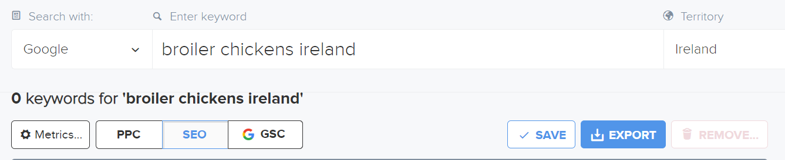
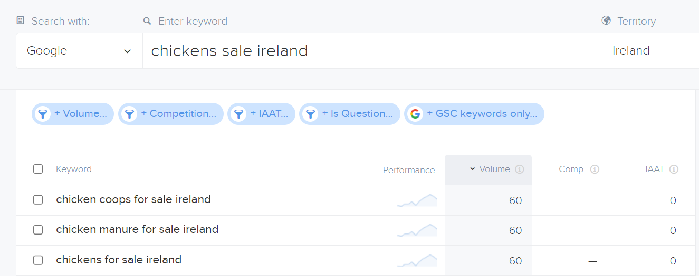
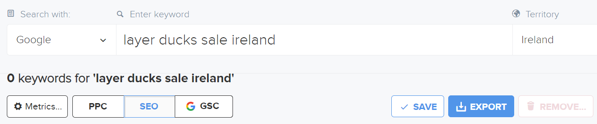
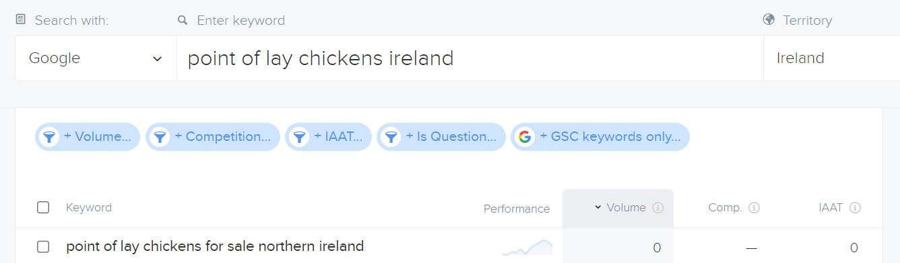
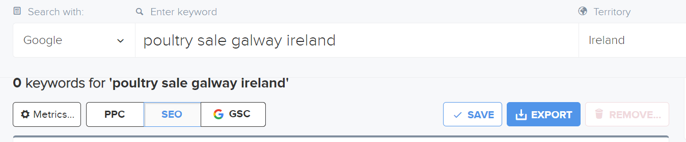
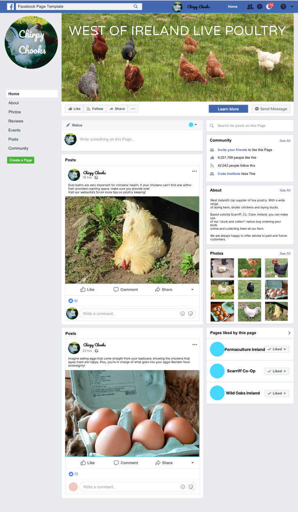

# SEO and Marketing Research

## Table of Contents

- [Keyword Research](#keyword-research)
- [Research of similar businesses](#research-of-similar-businesses)
- [SEO Improvements](#seo-improvements)
- [Marketing Strategies](#marketing-strategies)

## Keyword Research

### Initial list of Keywords to research

- layer hens for sale Ireland
- layer chickens for sale Ireland
- layer ducks for sale Ireland
- broiler chickens for sale Ireland
- poultry sale west ireland
- poultry/chicken/ducks for sale Clare, Limerick, Galway

### Testing Keywords for volume and competition

I tested several long-tail keywords using the website [Wordtracker](https://www.wordtracker.com/).
Most keywords showed extremely low volume and competition.

## Research of similar businesses

The main inspiration for the DucksKenya fictional business was [Freeway Poultry](https://www.freewaypoultry.ie/).

Also the farming section of [DoneDeal](https://www.donedeal.ie/).

## SEO Improvements

**Meta tags**

In the head of base.html, ``<meta name="description" ...`` and ``<meta name="keywords" ...`` tags were included. 

**Creating a Sitemap**

The sitemap file sitemap.xml was created using [XML Sitemaps](https://www.xml-sitemaps.com/) to improve navigation of the site for search engines and to speed up content discovery.

**Creating a robots.txt file**

The file instructs search engines which directories not to crawl and index. It also links to the sitemap.
The existence of this file signals a level of quality to search engines and so improves SEO ranking as a result.

## Marketing Strategies

### Pre-strategy planning

DucksKenya is B2C business concept. It produces and sells its own products and has a limited distribution range.

Before deciding on marketing strategies and defining a business plan, I tried to answer the following question to provide a framework for the business' strategy:

**Which online platforms would you find lots of your users on?**

Facebook for younger users. DoneDeal for all age users.

**What do your users need? Could you meet that need with useful content? If yes, how could you best deliver that content to them?**

Users need poultry breeder local to the mid-west region of Ireland with selection of different poultry. Home delivery by store employee would be ideal. However, currently not implement by the business but open for future implementation.

**Would your business run sales or offer discounts? How do you think your users would most like to hear about these offers?**

Discounts for larger order are a valid option. Currently not implemented. Newsletter or facebook posts best way to keep users informed about updates to products and sales.

**What are the goals of your business? Which marketing strategies would offer the best ways to meet those goals?**

Goal is to provide the rural population of the specified region with a reliable and knowledgable poultry breeder. Not only supplying products but also providing a reliable contact for advice and information on poultry keeping.

**Would your business have a budget to spend on advertising? Or would it need to work with free or low cost options to market itself?**

To start with business would rely on free marketing options such as establishing a strong social media presence among its target customer base. Paying for sponsored advertising on DoneDeal is a valid option for the future.

### Strategies

Any paid marketing strategies were beyond the scope and requirements for this project as it is a fictional business created by a student.

- **Content Marketing => Forum**

    The forum provides useful and engaging content for anybody interested in or already keeping poultry.
    It also gives (potential) customers a feeling of constant support should they ever need advice on this subject, therefore creating a relationship with the business and a sense of loyalty.
    The forum gives the business the opportunity to demonstrate their expertise and experience, as well as a willingness to help and educate others.

- **Social Media Marketing => Mock FB page**

    

    The Facebook page ties in with the website's forum, promoting regular posts about important things to know about poultry keeping or interesting facts about specific breeds.
    Customers get the chance to feel more connected with the business by direct interactions such as commenting on posts or messaging the business via Facebook. 
    Overall, the shop's Facebook presence is the more interactive business aspect and makes it more approachable for customers.

    As the mid-western region of Ireland (specifically East Clare where DucksKenya is based) has seen a large influx of younger, alternative minded people in recent years, Facebook is a valid way of broadening the business' outreach.

    A Facebook page could easily be extended into further social media presence such as Instagram or Twitter. Using software to automate the content sharing process, this would not result in an increase of work load.

- **Location specific online presence => DoneDeal (not implemented)**

    As DucksKenya is a rural Irish business dealing in livestock, it would be quite appropriate to sell and advertise their products on [DoneDeal](https://www.donedeal.ie/), Ireland's largest buying and selling site. Most people resident in Ireland are very familiar with DoneDeal and also the older demographic, especially those of the agricultural community, use it a lot. Apart from motors, it's particularly popular for all farming related products and most independent Irish businesses that operate in that sector are also present on DoneDeal.

    For the scope of this project, I did not actually create a real DoneDeal account for DucksKenya. However, the above outline of the thought process is still relevant to the marketing strategy.

- **Email Marketing => MailChimp Newsletter**

    The MailChimp Newsletter subscription service is ideal for a small scale business like DucksKenya as it is free and simple to set up.
    Newsletter content could potentially be an early release of forum content, reducing the time needed for content creation.
    The newsletter subscription is completely optional for customers. The service is represented on the site in the footer as a small form, rather than an obtrusive pop-up so many other sites resort to these days.

